# Práctica #2 — Topología #3: HTTPS sin VPN + SSH por VPN IPsec Remote Access

> **Video de demostración:** [🎥 Ver video](PENDIENTE-URL-DEL-VIDEO)

**Asignatura:** Seguridad de Redes  
**Estudiante:** Luis Ariel Alevante Agramonte  
**Matrícula:** 2025-2174

---

## 1. Objetivo

Implementar en GNS3 una infraestructura donde el servidor web sea accesible por **HTTPS sin depender de una VPN**, mientras que el acceso administrativo por **SSH solo sea permitido a través de una VPN IPsec Remote Access** terminada en FortiGate.

La práctica demuestra que:

- `PC-USER-2174` opera en **VLAN 10** y recibe direccionamiento por DHCP.
- El servicio HTTPS de `WEB-SV-2174` se publica mediante NAT estático en `R-CISCO-2174` y funciona con la VPN apagada.
- El acceso SSH directo desde la red de usuarios está bloqueado explícitamente por FortiGate.
- `VPN-CLIENT-2174` utiliza **strongSwan** para establecer una VPN IPsec dial-up contra `FG-2174`.
- El cliente recibe la IP virtual `10.212.135.10/32` y una ruta específica hacia `10.21.74.130/32`.
- La política del túnel permite **solo SSH** hacia `WEB-SV-2174`.
- Con la VPN activa se logra iniciar sesión por SSH; al bajar el túnel, ese acceso deja de estar disponible.

---

## 2. Topología

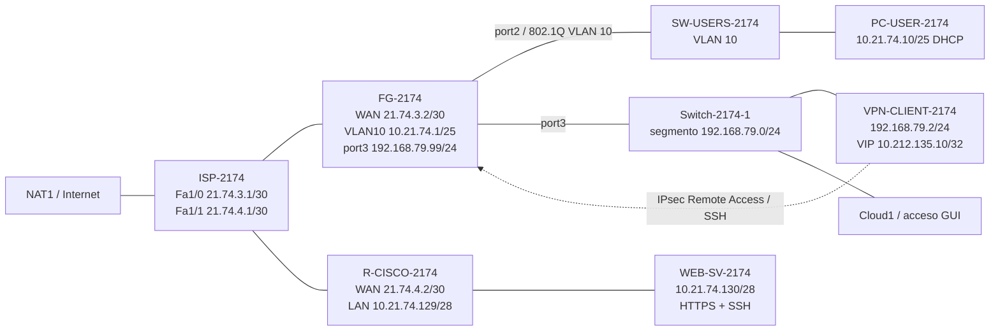

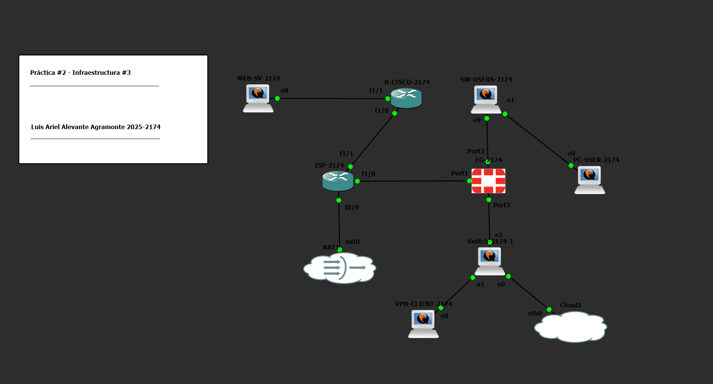

---

## 3. Plan de direccionamiento

| Equipo | Interfaz / función | Dirección |
|---|---|---|
| ISP-2174 | Fa0/0 hacia GNS3 NAT | DHCP |
| ISP-2174 | Fa1/0 hacia FortiGate | `21.74.3.1/30` |
| FG-2174 | WAN-ISP / port1 | `21.74.3.2/30` |
| FG-2174 | VLAN10-USERS | `10.21.74.1/25` |
| PC-USER-2174 | VLAN 10 / DHCP | `10.21.74.10/25` observado |
| ISP-2174 | Fa1/1 hacia R-CISCO | `21.74.4.1/30` |
| R-CISCO-2174 | Fa1/0 WAN | `21.74.4.2/30` |
| R-CISCO-2174 | Fa1/1 LAN servidor | `10.21.74.129/28` |
| WEB-SV-2174 | ens3 | `10.21.74.130/28` |
| FG-2174 | port3 / terminación VPN | `192.168.79.99/24` |
| VPN-CLIENT-2174 | ens3 | `192.168.79.2/24` |
| VPN-REMOTE-2174 | Pool de clientes | `10.212.135.10–10.212.135.20` |
| VPN-CLIENT-2174 | IP virtual observada | `10.212.135.10/32` |

Más detalle: [`docs/direccionamiento.md`](docs/direccionamiento.md)

---

## 4. Componentes del entorno

- GNS3 + GNS3 VM sobre VMware
- FortiGate VM64-KVM 7.0.9
- Cisco C7200 como `ISP-2174`
- Cisco C7200 como `R-CISCO-2174`
- Cisco IOSvL2 para VLAN/trunk
- Ubuntu para `PC-USER-2174`, `WEB-SV-2174` y `VPN-CLIENT-2174`
- strongSwan como cliente IPsec
- Apache2 sobre HTTPS/443
- OpenSSH Server sobre TCP/22
- GNS3 NAT para salida a Internet del laboratorio

---

## 5. Configuración implementada

### 5.1 VLAN 10 y DHCP

`FG-2174` actúa como gateway de usuarios mediante `VLAN10-USERS` sobre `port2`:

- Gateway: `10.21.74.1/25`
- VLAN ID: `10`
- DHCP: `10.21.74.10 - 10.21.74.100`
- DNS: `8.8.8.8` y `1.1.1.1`
- `Gi0/0` del switch: trunk 802.1Q, VLAN 10 permitida
- `Gi0/1`: access VLAN 10 hacia `PC-USER-2174`

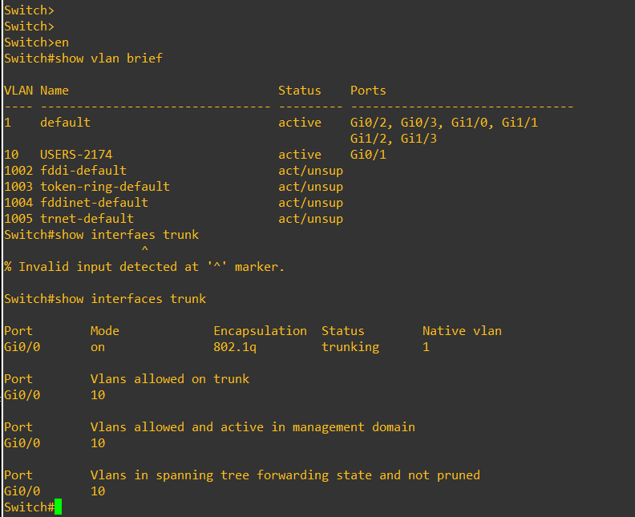

### 5.2 FortiGate

Interfaces principales:

- `WAN-ISP (port1)` → `21.74.3.2/30`
- `VLAN10-USERS` → `10.21.74.1/25`
- `port3` → `192.168.79.99/24`
- `VPN-REMOTE-2174` → interfaz de túnel dial-up

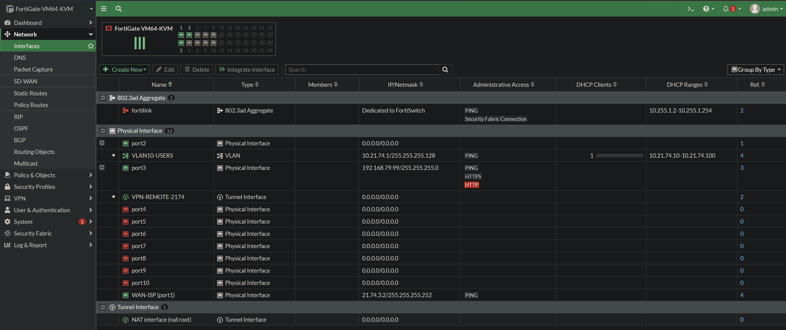

La ruta por defecto utiliza `21.74.3.1` por `WAN-ISP (port1)`.

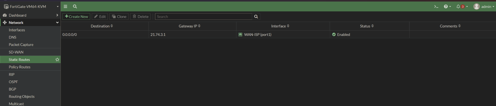

### 5.3 Políticas de seguridad

Las políticas principales implementadas son:

| Política | Flujo | Servicio | Acción | NAT |
|---|---|---|---|---|
| `DENY-DIRECT-SSH-WEB` | VLAN10 → WEB-SV | SSH | DENY | No |
| `USER-TO-INTERNET` | VLAN10 → WAN | ALL | ACCEPT | Sí |
| `vpn_VPN-REMOTE-2174_remote_0` | VPN → WEB-SV | SSH | ACCEPT | Sí |

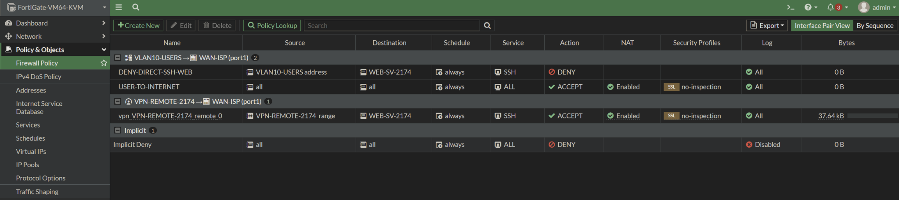

La regla de denegación se evalúa antes de la política general de salida, evitando que SSH directo alcance el servidor.

### 5.4 R-CISCO-2174 y publicación HTTPS

`R-CISCO-2174` conecta la red del servidor con el ISP:

- `Fa1/0` → `21.74.4.2/30` (`ip nat outside`)
- `Fa1/1` → `10.21.74.129/28` (`ip nat inside`)
- Default route → `21.74.4.1`

HTTPS se publica mediante NAT estático:

```text
21.74.4.2:443  ->  10.21.74.130:443
```

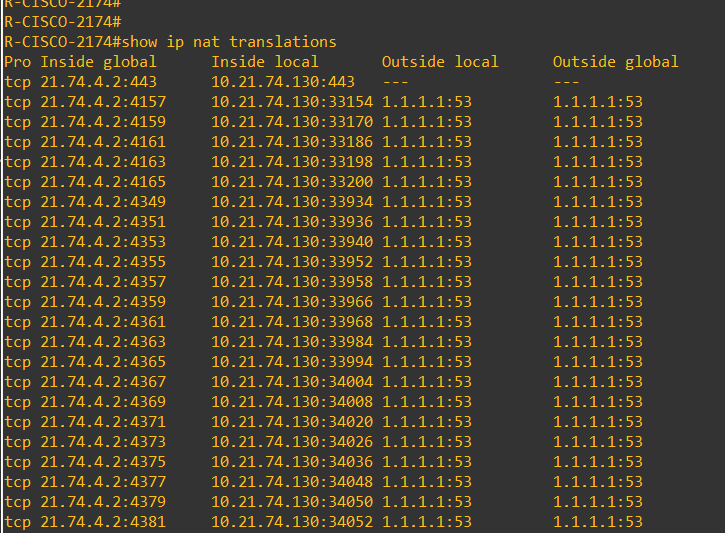

Para el retorno del SSH proveniente del FortiGate, la ACL 101 evita aplicar PAT al tráfico del servidor destinado a `21.74.3.2`:

```text
access-list 101 deny   ip 10.21.74.128 0.0.0.15 host 21.74.3.2
access-list 101 permit ip 10.21.74.128 0.0.0.15 any
```

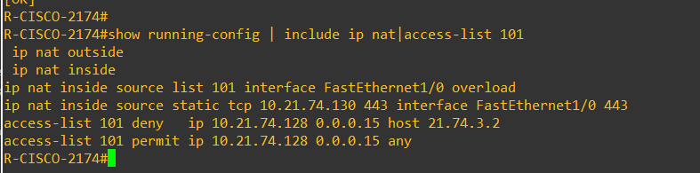

### 5.5 Enrutamiento del ISP

El ISP conoce la red del servidor mediante:

```text
10.21.74.128/28 via 21.74.4.2
```

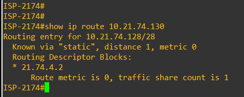

### 5.6 VPN IPsec Remote Access

El túnel `VPN-REMOTE-2174` termina en `port3` del FortiGate y utiliza autenticación PSK + XAUTH.

**Phase 1**

- IKEv1
- Aggressive Mode
- DES-MD5 / DES-SHA1
- DH Group 5
- XAUTH mediante el grupo `SSLVPN-USER-2174`
- Pool: `10.212.135.10 - 10.212.135.20`
- Split tunnel limitado a `WEB-SV-2174`

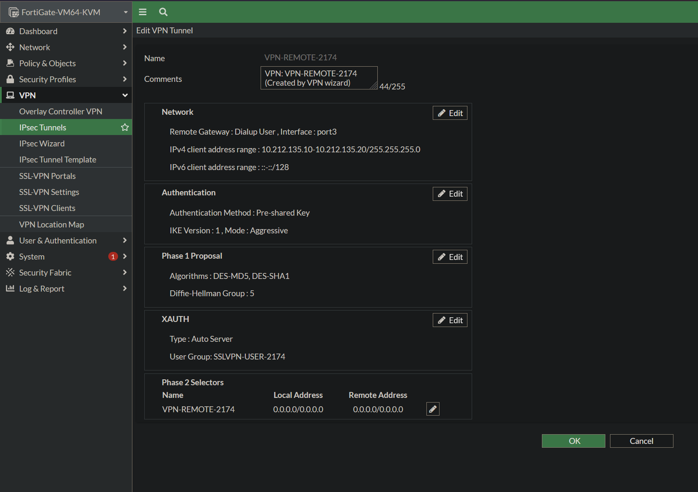

**Phase 2**

- DES-MD5 / DES-SHA1
- PFS habilitado
- DH Group 5
- Key Lifetime: `43200` segundos

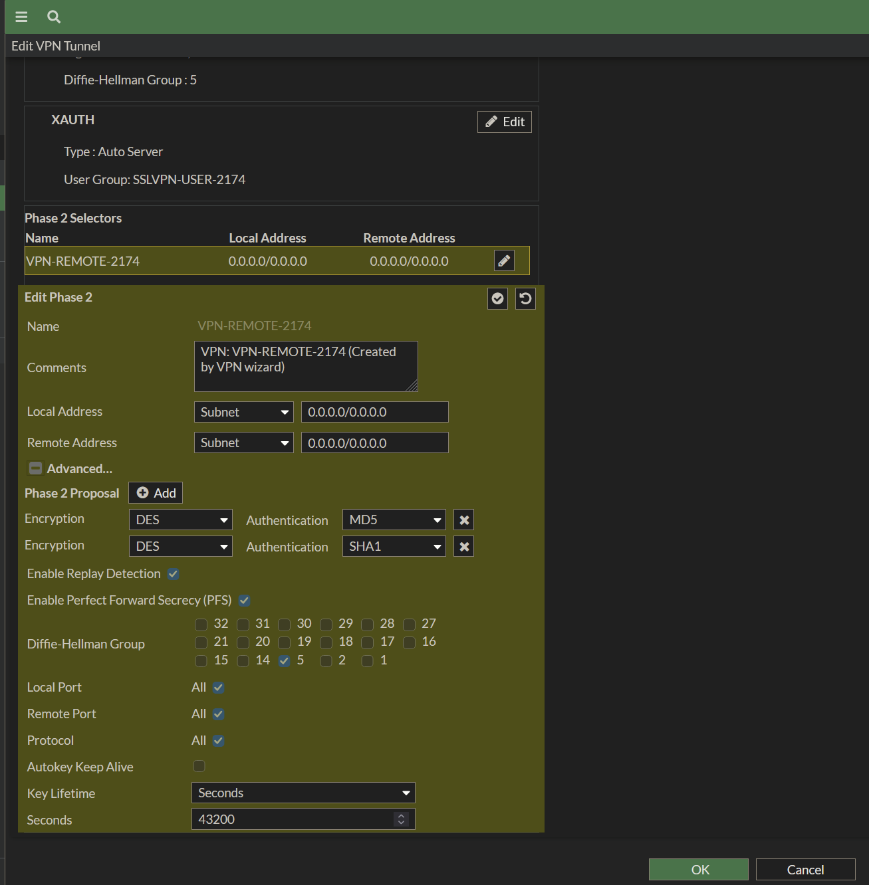

> **Nota de seguridad:** IKEv1, DES y SHA1 se mantienen únicamente por compatibilidad con este laboratorio. No deben tomarse como parámetros recomendados para un despliegue de producción moderno.

### 5.7 Cliente strongSwan

`VPN-CLIENT-2174` utiliza `192.168.79.2/24` y negocia contra `192.168.79.99`.

La configuración pública se encuentra en [`configs/VPN-CLIENT-2174-ipsec.conf`](configs/VPN-CLIENT-2174-ipsec.conf). Las credenciales reales no se publican.

Cuando el túnel se establece, strongSwan obtiene `10.212.135.10/32` y crea una ruta específica hacia `10.21.74.130`.

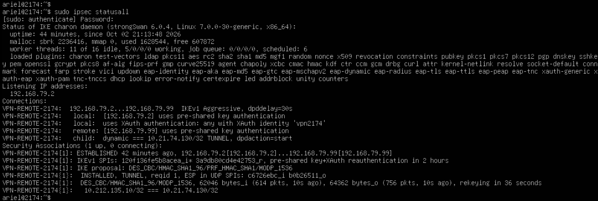

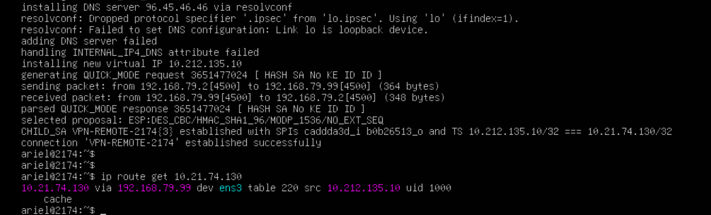

### 5.8 Servidor

`WEB-SV-2174` utiliza:

- IP: `10.21.74.130/28`
- Gateway: `10.21.74.129`
- HTTPS: TCP/443 mediante Apache2
- SSH: TCP/22 mediante OpenSSH Server

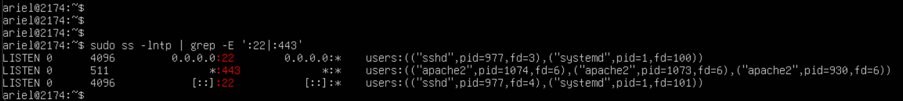

---

## 6. Validación funcional

### 6.1 HTTPS funciona sin VPN

Con el túnel apagado, desde `PC-USER-2174`:

```bash
curl -k -I https://21.74.4.2
```

Resultado observado:

```text
HTTP/1.1 200 OK
Server: Apache/2.4.66 (Ubuntu)
```

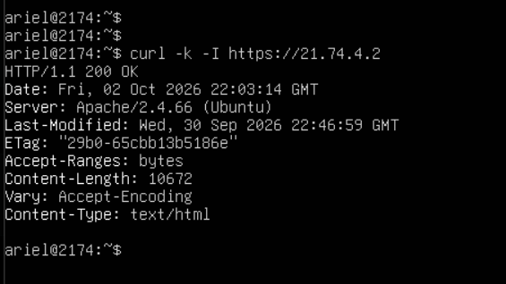

### 6.2 SSH directo está bloqueado

Desde el mismo `PC-USER-2174`:

```bash
ssh -o ConnectTimeout=5 ariel@10.21.74.130
```

Resultado observado: `Connection timed out`.

La evidencia conjunta muestra HTTPS operativo y SSH directo bloqueado sin VPN:

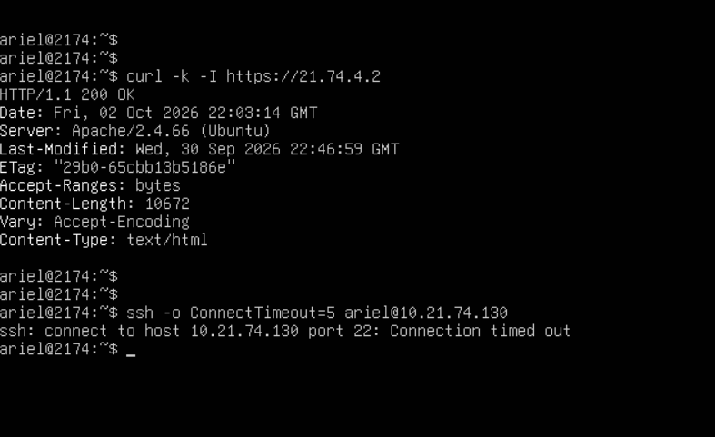

### 6.3 SSH funciona mediante la VPN

Después de establecer `VPN-REMOTE-2174`, la asociación IPsec queda activa y el cliente recibe `10.212.135.10/32`.

```bash
sudo ipsec up VPN-REMOTE-2174
ssh ariel@10.21.74.130
```

El acceso SSH se completa correctamente:

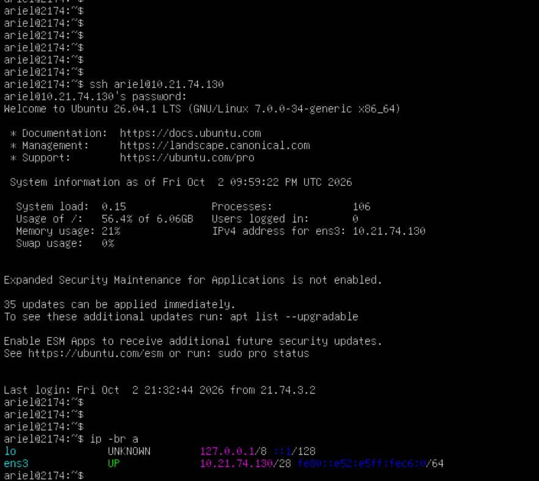

### 6.4 Al bajar la VPN, el acceso protegido desaparece

```bash
sudo ipsec down VPN-REMOTE-2174
ssh ariel@10.21.74.130
```

El túnel se elimina y el cliente deja de disponer de la ruta protegida al servidor.

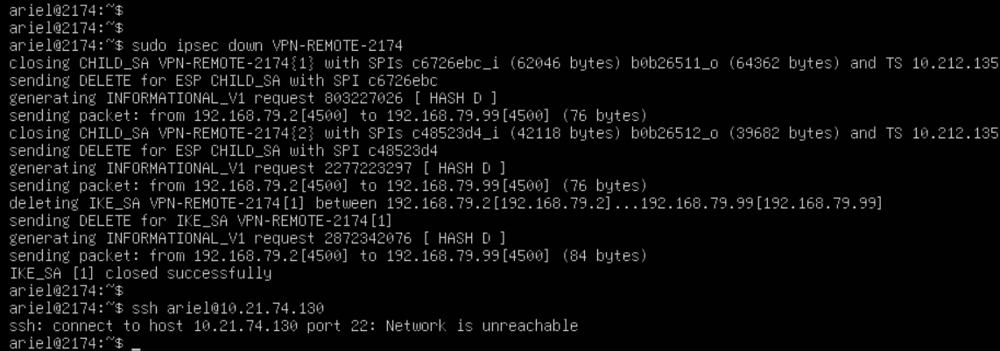

La matriz completa de pruebas está en [`docs/validacion.md`](docs/validacion.md).

---

## 7. Configuraciones y scripts

### Running-configs

[`running-configs/`](running-configs/) contiene:

- `FG-2174-sanitized.conf`
- `ISP-2174.txt`
- `R-CISCO-2174.txt`
- `SW-USERS-2174.txt`

El FortiGate publicado es un **extracto funcional sanitizado**. No contiene la PSK real, contraseña del usuario VPN, contraseña administrativa, certificados privados ni claves privadas.

### Configuraciones Linux / VPN

[`configs/`](configs/) contiene:

- `VPN-CLIENT-2174-ipsec.conf`
- `ipsec.secrets.example`
- `WEB-SV-2174-netplan.yaml`
- `PC-USER-2174-netplan.yaml`
- `VPN-CLIENT-2174-netplan.yaml`

### Scripts

[`scripts/`](scripts/) contiene scripts y comandos de apoyo para reproducir las validaciones y servicios principales.

---

## 8. Resultado

La Infraestructura 3 cumple los dos comportamientos requeridos de forma independiente:

- **HTTPS permanece disponible sin VPN** mediante la publicación TCP/443 del router Cisco.
- **SSH directo está bloqueado** desde la red normal de usuarios.
- **SSH funciona a través de la VPN IPsec Remote Access**, donde FortiGate autentica al cliente, asigna una IP virtual, limita el split tunnel al servidor y permite únicamente el servicio SSH.

De esta forma, el acceso web y el acceso administrativo quedan separados según el nivel de protección requerido.

---

## Estructura del repositorio

```text
SR-PRACTICA-2-INFRAESTRUCTURA-3/
├── README.md
├── .gitignore
├── docs/
│   ├── direccionamiento.md
│   └── validacion.md
├── evidencias/
│   ├── README.md
│   └── 01 ... 30
├── running-configs/
│   ├── README.md
│   ├── FG-2174-sanitized.conf
│   ├── ISP-2174.txt
│   ├── R-CISCO-2174.txt
│   └── SW-USERS-2174.txt
├── configs/
│   ├── VPN-CLIENT-2174-ipsec.conf
│   ├── ipsec.secrets.example
│   ├── WEB-SV-2174-netplan.yaml
│   ├── PC-USER-2174-netplan.yaml
│   └── VPN-CLIENT-2174-netplan.yaml
└── scripts/
    ├── README.md
    ├── web-server-services-setup.sh
    ├── test-pc-user.sh
    ├── test-vpn-client.sh
    ├── switch-setup.txt
    └── r-cisco-critical-config.txt
```
